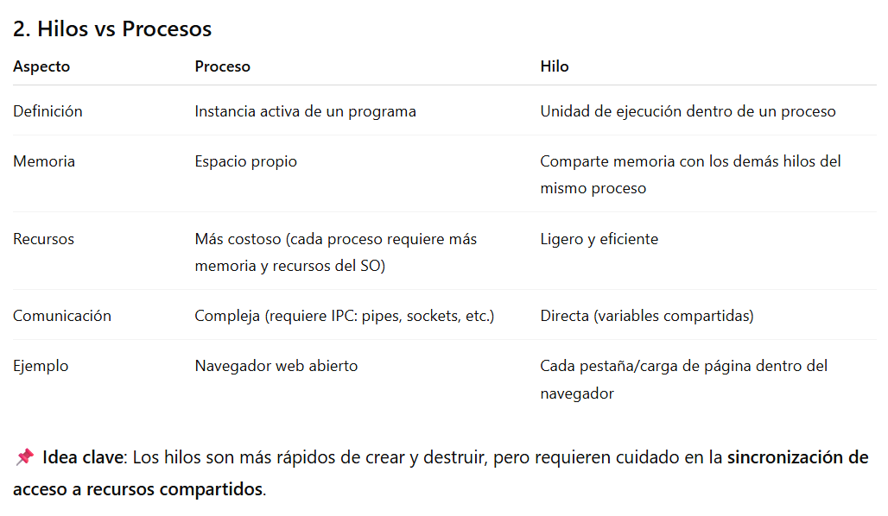
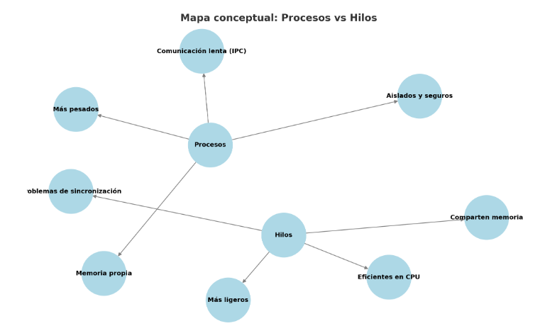

# Programación sobre redes - Carrera Desarrollo de Software

## Clase 1 - Programación concurrente

🔹 Introducción

1. ¿Qué es la programación concurrente?

Definición: Paradigma donde múltiples tareas (procesos o hilos) progresan de forma solapada.

No implica siempre ejecución simultánea física, salvo en sistemas multinúcleo.

Objetivo: eficiencia y respuesta más rápida en aplicaciones que realizan varias tareas (ej.: servidores web, simulaciones, juegos en red).

🔹 Ejemplo intuitivo:
Un restaurante con un solo cocinero (CPU de un núcleo). Este puede ir alternando entre preparar entradas, plato principal y postre sin terminar uno antes de empezar el otro → concurrencia.
Si hay varios cocineros (CPU multinúcleo), realmente trabajan en paralelo → paralelismo.

2. Hilos vs procesos



3. Problemas de concurrencia y sincronización

La concurrencia trae riesgos:

Condiciones de carrera (race conditions): cuando dos hilos acceden y modifican la misma variable al mismo tiempo → resultados impredecibles.

Interbloqueo (deadlock): dos hilos esperan recursos bloqueados mutuamente → ninguno avanza.

Inanición (starvation): un hilo nunca obtiene tiempo de CPU.

🔧 Mecanismos de control en Python:

Lock (bloqueos mutuos).

Semaphore (control de acceso a recursos limitados).

Condition (coordinar hilos: esperar y notificar).

Event (señales entre hilos).

4. Ejercicios prácticos (del PDF)

Ejercicio 1: Contar en paralelo (dos hilos, 1–5 y 6–10).

Ejercicio 2: Sincronización con Condition: esperar a que ambos hilos terminen antes de imprimir el resultado final.

💡 Estos ejercicios preparan para aplicaciones reales como servidores concurrentes que atienden múltiples clientes.

5. Glosario

Concurrencia: Ejecución solapada de tareas.

Paralelismo: Ejecución real al mismo tiempo (varios núcleos).

Proceso: Programa en ejecución con memoria propia.

Hilo (thread): Unidad de ejecución dentro de un proceso.

Race condition: Conflicto por acceso concurrente a recursos.

Deadlock: Bloqueo mutuo entre procesos o hilos.

Sincronización: Técnicas para coordinar la ejecución concurrente.

🔹 Ejercicios

Mejorar el código presentado:

1. "Contando en paralelo"

Parámetros Flexibles: El resuelto tiene el rango que se calculaba con inicio + i y el límite estaba hardcodeado

Configuración Centralizada: Los hilos se creaban manualmente uno por uno.

Manejo Dinámico de Hilos: Join explícito para cada hilo (hilo1.join(), hilo2.join()).

2.  "Sincronización de hilos"

Eliminación de Variables Globales: condicion y resultados son globales.

Uso de wait_for en lugar de while: Bucle while len(resultados) < 2 con wait().

Generación Dinámica de Hilos: Hilos creados manualmente (hilo1, hilo2).

Cálculo Directo con sum(range()): Bucle for para sumar números.

## Clase 2 - Procesos e hilos (Multithreading)

🔹 Hilos (Multithreading)

Permiten ejecutar múltiples tareas dentro de un mismo proceso.

Se ejecutan en paralelo (si hay varios núcleos) o concurrentemente (si hay un solo núcleo).

Uso típico: descargas en segundo plano, procesamiento simultáneo, mantener interfaces gráficas activas.

Ventajas: eficiencia, mejor uso de CPU, interactividad.
Desventajas: problemas de sincronización, mayor complejidad, sobrecarga si se crean demasiados hilos.

🔹 Procesos

Un proceso = un programa en ejecución con su propio espacio de memoria.

Cada proceso es independiente y no accede directamente a la memoria de otro.

Contiene segmentos de memoria: código, datos, pila, heap.

Estados: nuevo, ejecutando, esperando, listo, terminado.

Identificador único: PID.

Comunicación entre procesos (IPC): pipes, memoria compartida, colas de mensajes, sockets.

Ventajas: aislamiento, seguridad.
Desventajas: mayor consumo de recursos, comunicación más lenta que entre hilos.

🔹 Diferencia clave

Proceso: unidad independiente, memoria aislada.

Hilo: subunidad dentro de un proceso, comparte memoria y recursos.

🔹 Glosario de términos clave

Hilo (Thread): unidad mínima de ejecución dentro de un proceso.

Proceso: programa en ejecución con memoria y recursos propios.

PID: identificador único de un proceso.

Heap: memoria dinámica del proceso.

Stack (pila): memoria temporal para funciones y variables locales.

Condición de carrera: error cuando dos hilos acceden al mismo recurso sin control.

IPC (Inter-Process Communication): mecanismos de comunicación entre procesos.

Mapa conceptal: Procesos vs Hilos



# PFO1 – Chat básico cliente/servidor con sockets y SQLite

Este proyecto implementa un **chat simple cliente–servidor** en Python utilizando **sockets TCP** y **SQLite** para almacenamiento de mensajes.  
El objetivo es aprender a configurar un servidor que reciba mensajes de clientes, los guarde en una base de datos y envíe confirmaciones, aplicando buenas prácticas de modularización y manejo de errores.

---

## 📂 Estructura del proyecto

- [`server.py`](https://github.com/mgmaxi/TDS-Programacion-Sobre-Redes/blob/main/PFO1/server.py)  
  Servidor que escucha en `localhost:5000`, recibe mensajes, los almacena en `mensajes.db` y responde con confirmación.

- [`client.py`](https://github.com/mgmaxi/TDS-Programacion-Sobre-Redes/blob/main/PFO1/client.py)  
  Cliente que se conecta al servidor y permite enviar múltiples mensajes hasta escribir `éxito`.

- [`mensajes.db`](https://github.com/mgmaxi/TDS-Programacion-Sobre-Redes/blob/main/PFO1/mensajes.db)  
  Base de datos SQLite donde se almacenan los mensajes (`id, contenido, fecha_envio, ip_cliente`).

---

## 🚀 Ejecución

1. **Clonar el repositorio**:

```
  git clone https://github.com/mgmaxi/TDS-Programacion-Sobre-Redes.git
  cd TDS-Programacion-Sobre-Redes/PFO1
```

2. **Ejecutar el servidor**:

```python
python server.py
```

3. **Ejecutar el cliente**:

```python
python client.py
```

4. **Consultar la base de datos**

```
sqlite3 mensajes.db
```

---

# PFO 2 – Sistema de Gestión de Tareas (API + SQLite)

---

## Instalación y ejecución

```bash
# 1) Crear y activar entorno virtual
python -m venv .venv
.venv\Scripts\activate

# 2) Instalar dependencias
pip install -r requirements.txt

# 3) Ejecutar el servidor
python servidor.py
# El servicio quedará en http://127.0.0.1:5000
```

---

## Endpoints

### 1) Registro de Usuarios — `POST /registro`

**Body JSON**

```json
{ "usuario": "maxi", "contraseña": "1234" }
```

**Respuestas**

- `201 Created` → usuario creado
- `409 Conflict` → usuario ya existe
- `400 Bad Request` → faltan campos

### 2) Inicio de Sesión — `POST /login`

**Body JSON**

```json
{ "usuario": "maxi", "contraseña": "1234" }
```

**Respuestas**

- `200 OK` → credenciales válidas
- `401 Unauthorized` → credenciales inválidas
- `400 Bad Request` → faltan campos

### 3) Bienvenida (con auth) — `GET /tareas`

**Ejemplo con `curl`:**

```bash
# Registro
curl -s -X POST http://127.0.0.1:5000/registro \
  -H "Content-Type: application/json" \
  -d '{"usuario":"maxi","contraseña":"1234"}'

# Login
curl -s -X POST http://127.0.0.1:5000/login \
  -H "Content-Type: application/json" \
  -d '{"usuario":"maxi","contraseña":"1234"}'

# Acceso a /tareas con auth
curl -u maxi:1234 http://127.0.0.1:5000/tareas
```
